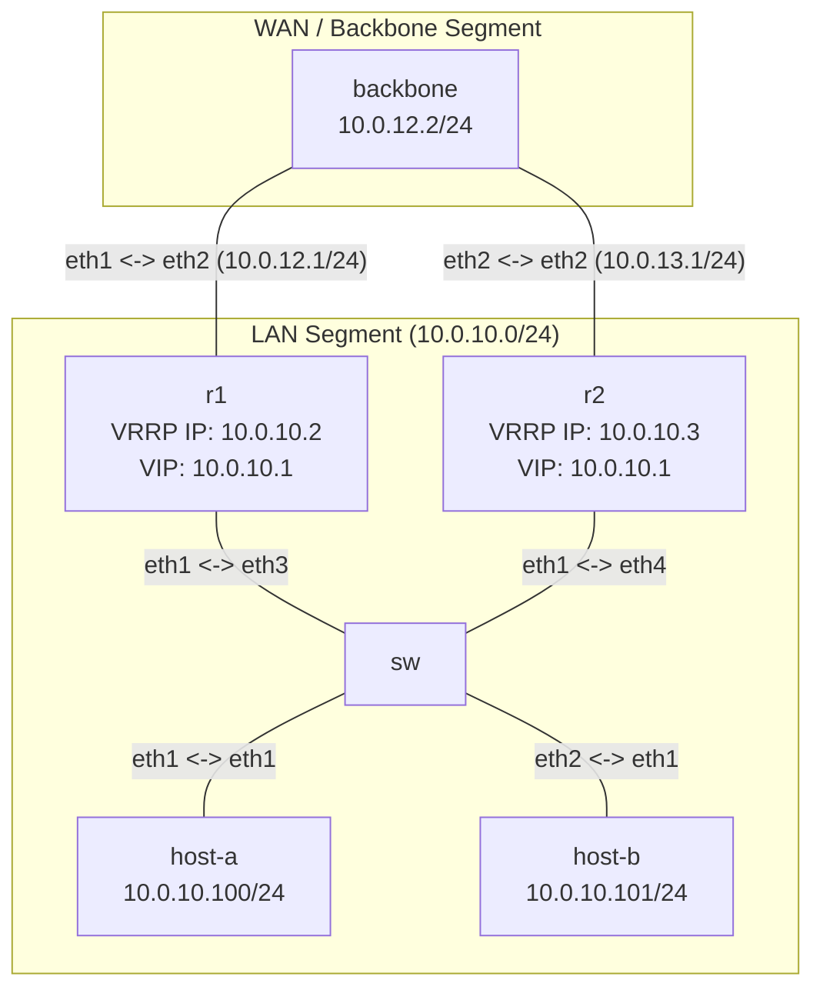

# Lab: Troubleshooting Chaos — VRRP + OSPF

## Mục tiêu
- Rèn kỹ năng troubleshoot giao thức dự phòng gateway (VRRP).
- Phân tích và xử lý lỗi split-brain VRRP (trùng lặp Master) và mất đồng bộ định tuyến OSPF đi kèm.
- **Không có gợi ý sẵn** — tự điều tra và khắc phục. Xem [`AI-TROUBLESHOOTING.md`](./AI-TROUBLESHOOTING.md) nếu muốn dùng AI hỗ trợ (không phải hỏi thẳng đáp án).

## Yêu cầu tiên quyết
Đã nắm cách cấu hình VRRP (FRR `vrrpd`) và kết hợp với định tuyến động OSPF.

## Tình huống

Hệ thống LAN công ty dùng hai router gateway `r1` và `r2` chạy VRRP để dự phòng gateway ảo `10.0.10.1`. Đồng nghiệp báo cáo:

> "Tôi đã cấu hình VRRP trên cả hai router, R1 có priority 200 (đáng lẽ làm Master) và R2 có priority 100 (đáng lẽ làm Backup). Tuy nhiên mạng chập chờn liên tục. Kiểm tra trạng thái VRRP thì thấy cả R1 và R2 đều tự nhận là Master! Hơn nữa khi tắt R1 thì R2 cũng không định tuyến được traffic ra internet."

## Sơ đồ topology



Xem [`topology/chaos-vrrp.clab.yml`](./topology/chaos-vrrp.clab.yml).

## Chạy lab

```bash
cd demo-1
sudo containerlab deploy -t topology/chaos-vrrp.clab.yml
```

Dọn dẹp sau khi xong:

```bash
sudo containerlab destroy -t topology/chaos-vrrp.clab.yml
```

## Đề bài / Yêu cầu

1. Deploy topology.
2. Xác nhận lỗi:
   - `docker exec -it clab-chaos-vrrp-lab-r1 vtysh -c "show ip vrrp"` và tương tự trên `r2` — xác nhận cả hai đều `Master`.
   - Ping từ host-a/host-b tới backbone (`10.0.12.2` / `10.0.13.2`) — thấy chập chờn.
   - Thử tắt r1 (`docker exec clab-chaos-vrrp-lab-r1 ip link set eth1 down`), xác nhận host mất kết nối ra ngoài dù r2 vẫn chạy.
3. Tìm nguyên nhân gốc. **Không có gợi ý.** Hướng điều tra:
   - Thông số VRRP (VRID, IP ảo) trên hai router đã khớp nhau chưa?
   - Router backup đã quảng bá đúng mạng LAN vào OSPF chưa?
4. Sửa lỗi trực tiếp qua `vtysh` trên router liên quan.
5. Xác nhận sửa thành công:
   - r1 là `Master`, r2 là `Backup`.
   - Ping từ host-a/host-b ra backbone thông ổn định.
   - Shutdown cổng LAN r1 → r2 lên `Master`, định tuyến không gián đoạn.
6. Ghi lại: quá trình điều tra, nguyên nhân, lệnh đã dùng để sửa.

## Lời giải tham khảo

<details>
<summary>⚠️ Bấm để xem — chỉ mở sau khi đã tự troubleshoot hoặc thật sự bí!</summary>

### Lỗi 1: VRID và VIP trên r2 không khớp r1 — split-brain
- **Triệu chứng**: cả r1 và r2 đều tự nhận Master.
- **Chẩn đoán**: `show run` trên r2: `vrrp 20 ip 10.0.10.100` — trong khi r1 dùng `vrrp 10 ip 10.0.10.1`. Khác VRID nghĩa là hai router thuộc hai nhóm VRRP khác nhau, không nghe advertisement của nhau → mỗi bên tự làm Master nhóm riêng. VIP của r2 còn trùng IP host-a (10.0.10.100) — xung đột địa chỉ.
- **Sửa** (trên r2 qua vtysh):
  ```
  conf t
  interface eth1
    no vrrp 20
    vrrp 10
    vrrp 10 ip 10.0.10.1
    vrrp 10 priority 100
  ```

### Lỗi 2: OSPF trên r2 khai sai network — mất đường khi failover
- **Triệu chứng**: tắt r1 thì host mất kết nối ra ngoài dù r2 còn sống.
- **Chẩn đoán**: `show run` trên r2: `network 10.0.20.0/24 area 0` — sai, LAN thật là `10.0.10.0/24`. r2 không quảng bá LAN vào OSPF → backbone không có route trả về LAN qua r2.
- **Sửa** (trên r2 qua vtysh):
  ```
  conf t
  router ospf
    no network 10.0.20.0/24 area 0
    network 10.0.10.0/24 area 0
  ```

**Xác nhận cuối:** r1 `Master`, r2 `Backup` (`show ip vrrp`); ping từ host ra backbone ổn định; shutdown cổng LAN r1 → r2 lên Master, ping tiếp tục thông.

</details>

## Dùng AI hỗ trợ troubleshoot
Muốn dùng AI (Claude Code...) làm trợ lý điều tra thay vì tự mò 100%? Xem quy trình và prompt mẫu tại [`AI-TROUBLESHOOTING.md`](./AI-TROUBLESHOOTING.md).
