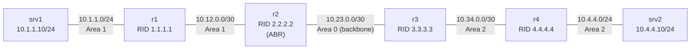

# Lab: Troubleshooting Chaos — OSPF Multi-Area

## Mục tiêu
- Rèn kỹ năng troubleshoot **có phương pháp**: thu hẹp phạm vi lỗi từng bước thay vì đoán mò.
- Phân tích sự cố OSPF nhiều area: adjacency không hình thành, route không lan truyền.
- **Không có gợi ý sẵn** — tự điều tra và khắc phục. Xem [`AI-TROUBLESHOOTING.md`](./AI-TROUBLESHOOTING.md) nếu muốn dùng AI hỗ trợ (không phải hỏi thẳng đáp án).

## Yêu cầu tiên quyết
Đã nắm OSPF nhiều area ở mức CCNA: vai trò area 0 (backbone), ABR, và các điều kiện để hai router lên neighbor.

## Tình huống

Hệ thống chạy OSPF ba area, nối hai site qua backbone. Đồng nghiệp báo cáo đúng một câu:

> "srv1 không ping được srv2."

Không có thêm thông tin nào khác. Không ai nói lỗi nằm ở thiết bị nào.

## Sơ đồ topology



| Đoạn | Subnet | Area theo thiết kế |
| :--- | :--- | :--- |
| srv1 ↔ r1 | 10.1.1.0/24 | 1 |
| r1 ↔ r2 | 10.12.0.0/30 | 1 |
| r2 ↔ r3 | 10.23.0.0/30 | **0 (backbone)** |
| r3 ↔ r4 | 10.34.0.0/30 | 2 |
| r4 ↔ srv2 | 10.4.4.0/24 | 2 |

Xem [`topology/chaos-ospf.clab.yml`](./topology/chaos-ospf.clab.yml).

## Chạy lab

```bash
cd demo-1
sudo containerlab deploy -t topology/chaos-ospf.clab.yml
```

Dọn dẹp sau khi xong:

```bash
sudo containerlab destroy -t topology/chaos-ospf.clab.yml
```

## Bảng ánh xạ FRR ↔ Cisco IOS

Lab chạy trên FRR (`vtysh`). Cú pháp gần trùng Cisco IOS — khác biệt lớn nhất là FRR khai **prefix**, Cisco khai **wildcard mask**. Khái niệm giống hệt nhau.

| Việc cần làm | FRR (`vtysh`) | Cisco IOS |
| :--- | :--- | :--- |
| Khai network vào area | `network 10.23.0.0/30 area 0` | `network 10.23.0.0 0.0.0.3 area 0` |
| Gỡ một khai báo network | `no network 10.23.0.0/30 area 2` | `no network 10.23.0.0 0.0.0.3 area 2` |
| Xem neighbor | `show ip ospf neighbor` | `show ip ospf neighbor` |
| Xem area / timer của interface | `show ip ospf interface eth1` | `show ip ospf interface Gi0/1` |
| Xem route học qua OSPF | `show ip route ospf` | `show ip route ospf` |
| Xem cấu hình đang chạy | `show run` | `show running-config` |
| Lưu cấu hình | `write` | `write memory` |

## Đề bài / Yêu cầu

1. Deploy topology.
2. Xác nhận triệu chứng:
   ```bash
   docker exec clab-chaos-ospf-lab-srv1 ping -c 4 10.4.4.10
   ```
3. Tìm nguyên nhân gốc. **Không có gợi ý.** Hướng điều tra:
   - Adjacency có hình thành trên **mọi** link không, hay đứt ở một chặng nào?
   - Hai đầu của link nghi ngờ có khai cùng tham số không?
   - Route bị thiếu ở đâu — thiếu từ router nào trở đi?
4. Sửa lỗi trực tiếp qua `vtysh` trên router liên quan.
5. Xác nhận sửa thành công:
   - Mọi link đều có neighbor ở trạng thái `Full`.
   - `r1` học được route tới `10.4.4.0/24`.
   - `srv1` ping `srv2` thông, 0% packet loss.
6. Ghi lại: quá trình điều tra, lệnh đã chạy, giả thuyết đã loại trừ, nguyên nhân cuối cùng.

### Lệnh kiểm tra hữu ích

```bash
# Neighbor trên từng router
docker exec clab-chaos-ospf-lab-r1 vtysh -c "show ip ospf neighbor"
docker exec clab-chaos-ospf-lab-r2 vtysh -c "show ip ospf neighbor"
docker exec clab-chaos-ospf-lab-r3 vtysh -c "show ip ospf neighbor"
docker exec clab-chaos-ospf-lab-r4 vtysh -c "show ip ospf neighbor"

# Route học qua OSPF
docker exec clab-chaos-ospf-lab-r1 vtysh -c "show ip route ospf"

# Tham số OSPF của một interface (area, timer, network type)
docker exec clab-chaos-ospf-lab-r2 vtysh -c "show ip ospf interface eth2"

# Vào CLI trực tiếp để sửa
docker exec -it clab-chaos-ospf-lab-r3 vtysh
```

## Lời giải tham khảo

<details>
<summary>⚠️ Bấm để xem — chỉ mở sau khi đã tự troubleshoot hoặc thật sự bí!</summary>

### Nguyên nhân: r3 khai link backbone sai area

- **Triệu chứng**: `show ip ospf neighbor` trên `r2` **rỗng** — không thấy `3.3.3.3`. Trên `r3` chỉ thấy `4.4.4.4`. Ba chặng còn lại (`r1↔r2`, `r3↔r4`) đều `Full`. Mạng bị tách làm hai nửa: `r1`/`r2` biết `10.1.1.0/24`, `r3`/`r4` biết `10.4.4.0/24`, không bên nào biết mạng của bên kia.

- **Chẩn đoán**: `show run` trên `r3`:
  ```
  router ospf
    network 10.23.0.0/30 area 2      ← SAI
    network 10.34.0.0/30 area 2
  ```
  Trong khi `r2` khai đúng `network 10.23.0.0/30 area 0`.

- **Cơ chế**: Area ID nằm **trong gói Hello**. Hai đầu link `10.23.0.0/30` gửi Hello với Area ID khác nhau (`0.0.0.0` vs `0.0.0.2`) → mỗi bên loại bỏ Hello của bên kia → adjacency **không bao giờ** hình thành, neighbor không xuất hiện ở bất kỳ trạng thái nào (kể cả `Init`). Không có adjacency thì không trao đổi LSA, không có route.

- **Lỗi thiết kế đi kèm**: với cấu hình sai này, `r3` **không có interface nào thuộc area 0** → area 2 không còn chạm backbone. Vi phạm quy tắc nền tảng của OSPF: **mọi area phải kết nối trực tiếp tới area 0**. Sau khi sửa, `r3` mới trở thành ABR giữa area 0 và area 2.

- **Sửa** (trên r3 qua `vtysh`):
  ```
  conf t
  router ospf
    no network 10.23.0.0/30 area 2
    network 10.23.0.0/30 area 0
  end
  write
  ```

**Xác nhận cuối:**
```bash
docker exec clab-chaos-ospf-lab-r2 vtysh -c "show ip ospf neighbor"   # 3.3.3.3 -> Full
docker exec clab-chaos-ospf-lab-r1 vtysh -c "show ip route ospf"      # có 10.4.4.0/24
docker exec clab-chaos-ospf-lab-srv1 ping -c 4 10.4.4.10              # 0% packet loss
```

### Vì sao 4 giả thuyết kinh điển còn lại bị loại

Khi OSPF không lên neighbor, có 5 nguyên nhân hay gặp. Bài này chỉ đúng 1 — biết cách loại trừ 4 cái kia mới là kỹ năng:

| Giả thuyết | Lệnh loại trừ | Kết quả thật trong lab này |
| :--- | :--- | :--- |
| **Area ID lệch** | `show ip ospf interface <if>` hai đầu | ✅ **Đây là nguyên nhân** — r2 `Area 0.0.0.0` vs r3 `Area 0.0.0.2` |
| Subnet/netmask lệch | `show ip ospf interface <if>` | Loại — `10.23.0.1/30` và `10.23.0.2/30`, cùng subnet |
| Hello/Dead timer lệch | `show ip ospf interface <if>` | Loại — cả hai `Hello 10s, Dead 40s` |
| Authentication lệch | `show ip ospf` (dòng `Area has ... authentication`) | Loại — cả hai `Area has no authentication`.<br>⚠️ `show ip ospf interface` **không** in dòng auth khi auth tắt — đừng tìm ở đó |
| MTU lệch | `show ip ospf interface <if>` (dòng `MTU ... bytes`) | Loại — cả hai `MTU 9500 bytes` (mặc định containerlab, không phải 1500).<br>MTU lệch làm kẹt ở `ExStart/Exchange`, **không** làm neighbor biến mất hoàn toàn như ở đây |

Dấu hiệu phân biệt quan trọng: neighbor **không xuất hiện chút nào** → lỗi ở tầng Hello (area, subnet, timer, auth). Neighbor **xuất hiện rồi kẹt** ở `ExStart`/`Exchange` → nghi MTU.

</details>

## Dùng AI hỗ trợ troubleshoot
Muốn dùng AI (ChatGPT / Claude / Gemini) làm trợ lý điều tra thay vì tự mò 100%? Xem quy trình và prompt mẫu tại [`AI-TROUBLESHOOTING.md`](./AI-TROUBLESHOOTING.md).

---
*Kịch bản lab phỏng theo [thangphan205/containerlab-demo — 18-troubleshooting-chaos-lab](https://github.com/thangphan205/containerlab-demo/tree/main/bai-tap-ve-nha/18-troubleshooting-chaos-lab).*
