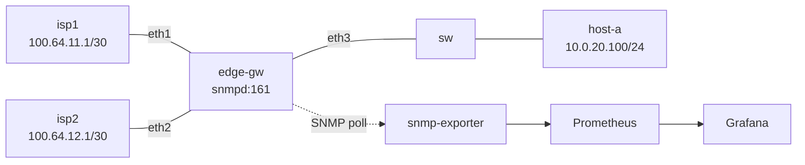

# Demo 2: Giám sát mạng bằng Grafana (containerlab + SNMP + Prometheus)

## Tình huống

Công ty đang giám sát hệ thống bằng Grafana, leader muốn xây dựng dashboard giám sát mạng gồm:
- Hardware Resource: CPU, RAM, Disk của thiết bị mạng.
- Thống kê trạng thái Port Up/Down.
- Băng thông sử dụng của 2 kênh truyền Internet.

## Kiến trúc

Lab dựng 1 router biên (`edge-gw`) có 2 uplink Internet, giám sát bằng **SNMP** — cách làm giống hệt khi giám sát thiết bị mạng thật (Cisco/MikroTik/Juniper...), chỉ cần đổi target IP là dùng được với thiết bị thật.



`edge-gw` chạy sẵn script sinh traffic (`gen-traffic.sh`, `iperf3`) tới `isp1`/`isp2` để 2 kênh uplink luôn có băng thông "sống" trên dashboard khi demo.

## Chuẩn bị

Cần: Docker + containerlab (chạy trên host Linux, hoặc VM Linux nếu máy là macOS — containerlab dùng network namespace của Linux).

Build image cho `edge-gw` (Debian + snmpd + iperf3):

```bash
cd demo-2/images
docker build -t demo2-edge-gw:latest -f edge-gw.Dockerfile .
```

Sinh file cấu hình `snmp_exporter` (chỉ cần chạy 1 lần, hoặc mỗi khi sửa `generator.yml`):

```bash
cd demo-2/monitoring/snmp_exporter
./generate.sh
```

## Chạy lab

```bash
cd demo-2
sudo containerlab deploy -t topology/network-monitoring.clab.yml
```

Deploy monitoring stack (Prometheus + snmp_exporter + Grafana) — join network `demo2-mgmt` do containerlab tạo ở bước trên:

```bash
cd demo-2/monitoring
docker compose up -d
```

Mở Grafana: [http://localhost:3000](http://localhost:3000) (user `admin` / pass `admin`), dashboard **Network Monitoring - Demo 2** đã được provision sẵn.

## Kiểm tra nhanh

```bash
# port + counters SNMP trên edge-gw
docker exec clab-network-monitoring-lab-edge-gw snmpwalk -v2c -c public localhost IF-MIB::ifOperStatus

# snmp_exporter trả metric OK
curl "http://localhost:9116/snmp?target=edge-gw&module=network_device"

# Prometheus thấy target UP
open http://localhost:9090/targets
```

## Kịch bản demo "Port Down"

```bash
docker exec clab-network-monitoring-lab-edge-gw ip link set eth1 down
```

→ Panel Port chuyển đỏ, băng thông kênh WAN1 về 0 trên Grafana trong vòng 1 chu kỳ scrape (15s). Bật lại:

```bash
docker exec clab-network-monitoring-lab-edge-gw ip link set eth1 up
```

## Dọn dẹp

```bash
cd demo-2/monitoring && docker compose down
cd demo-2 && sudo containerlab destroy -t topology/network-monitoring.clab.yml
```
